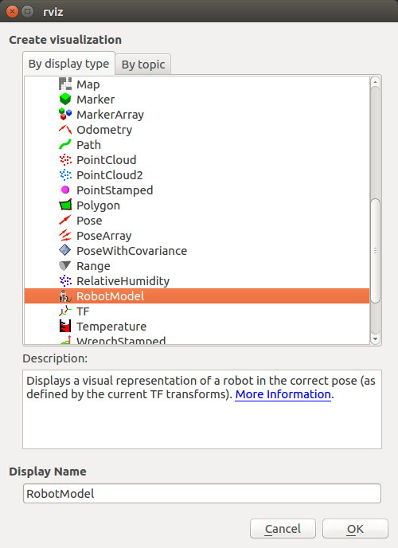

Simulating UR5-E
=================

Whether you actually have a Universal robot or not, simulating the arm inside of the Gazebo simulator is a great way to get started with ROS
robot development. In this tutorial, we will go through how to use a UR5-E robot arm inside a Gazebo simulation and how to control it with
the pre-made MoveIt! configuration.

Installation From Pre-Built Debs
--------------------------------

To get started with the Universal simulation, make sure you have a :roswiki:`working ROS installation <ROS/Installation>`
set up on your Ubuntu desktop, and install the Universal-specific simulation package:

.. code:: bash

    sudo apt-get install ros-kinetic-ur-gazebo

Launch Gazebo
-------------

Gazebo is the most common simulation tool used in ROS. To launch a simple simulated UR5-E in an empty example world, run the following command:

.. code-block:: bash

    roslaunch ur_e_gazebo ur5e.launch

You should see the following window appear, or something like it. You can adjust the camera angle by
clicking and dragging while holding CTRL, ALT, or the shift key:

The window which you are looking at is the Gazebo Client. This window shows you the "true" state of the
simulated world which the robot exists in. It communicates on the backend with the Gazebo Server, which
is doing the heavy lifting of actually maintaining the simulated world. At the moment, you're running
both the client and server locally on your own machine, but some advanced users may choose to run heavy
duty simulations on separate hardware and connect to them over the network.

Note that there are multiple versions of Universal robots, including the 3Kg, 5Kg and 10Kg payload versions.
This simulation is currently running with the new E version of the 5Kg payload arm, but the other arms are
also available in the ur_gazebo package.  For example, the UR10-E robot could be simulated using:

.. code-block:: bash

    roslaunch ur_e_gazebo ur10e.launch

The command above would run a simulator with the larger UR10-E in it:

.. image:: gazebo/gazebo-ur10-zeros.png
    :alt: Initial UR10-E position in Gazebo simulation.

Launch RVIZ
-----------

The next tool we will encounter is :roswiki:`RVIZ`. Although superficially similar in appearance to Gazebo,
RVIZ has a very different purpose— unlike Gazebo, which shows the reality of the simulated world, RVIZ shows
the robot's *perception* of its world, whether real or simulated. So while Gazebo won't be used with your
real Universal arm, RVIZ is used with both.

There is currently no pre-configured RVIZ setup to work with a Universal arm because they are used in such a wide
variety of uses so we will have to setup our RVIZ from scratch.  Launch RVIZ with the command below:

.. code-block:: bash

    rosrun rviz rviz

You should see RVIZ appear.  If you see red and yellow errors in your terminal, it likely means something isn't sourced properly in your ROS environment:

If you don't see the robot or you see a bunch of white shapes in the middle, there are two main settings you will have to check:

Expand Global Options and ensure that "base_link" is selected under Fixed Frame:

.. image:: gazebo/rviz-fixed-frame.jpg
    :alt: Fixed-frame configuration in RVIZ.

Make sure that there is a "RobotModel" display in the left bar and that it is enabled:

If you do not see this Display, click Add in the bottom left and select RobotModel out of the list

To make it so we don't need to make these changes every time we want to interact with our robot, you can click "File > Save Config".  This will overwrite
the default RVIZ config so it uses it every time it starts.  You can also select "File > Save Config As" and choose a non-standard location so you can
select this config if you need it.
