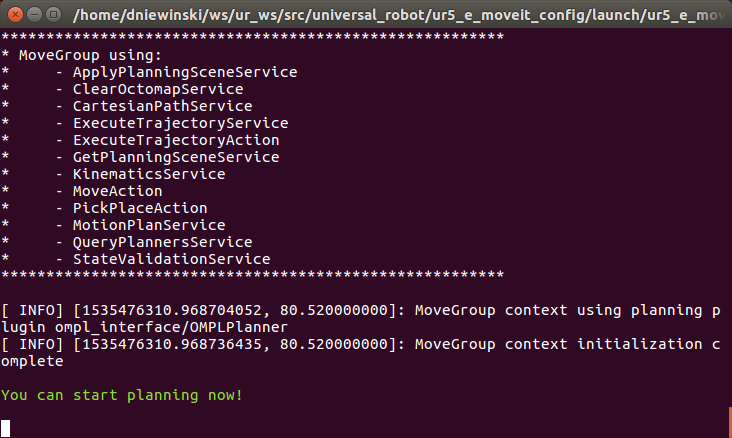
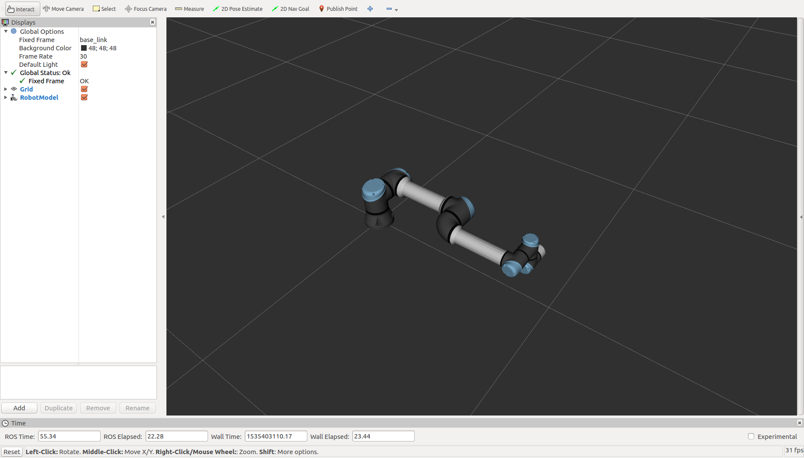
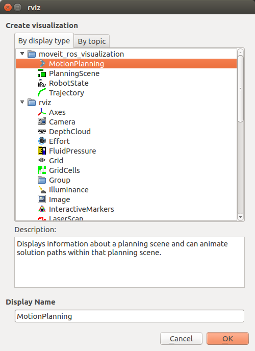
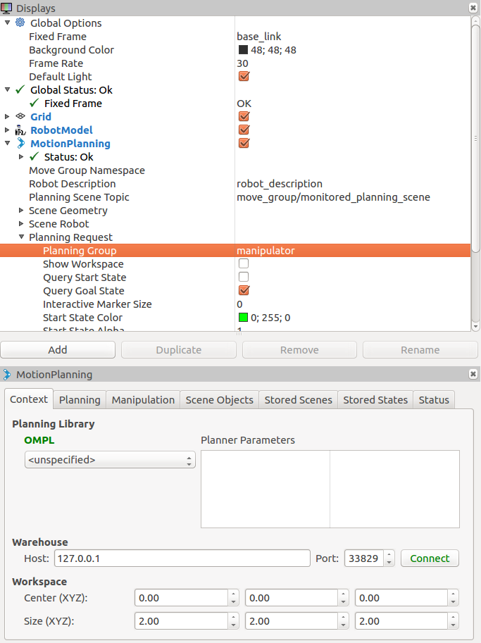
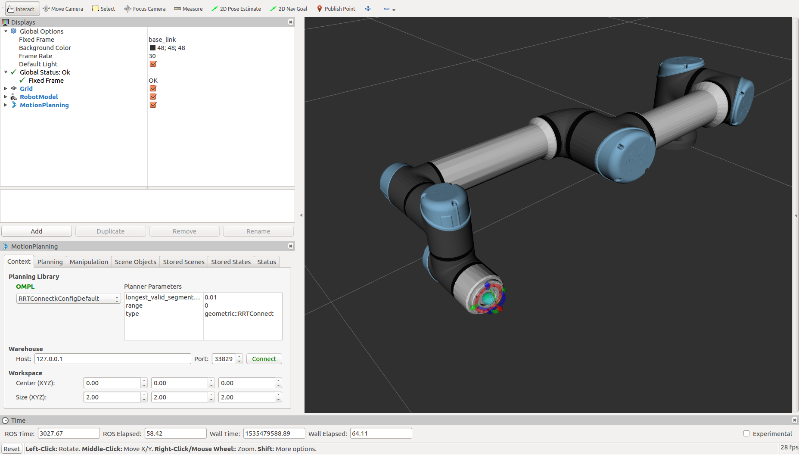
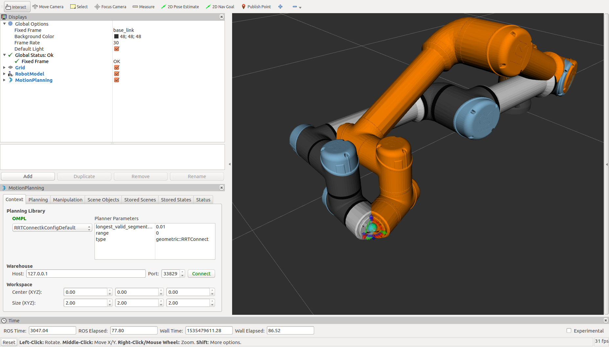
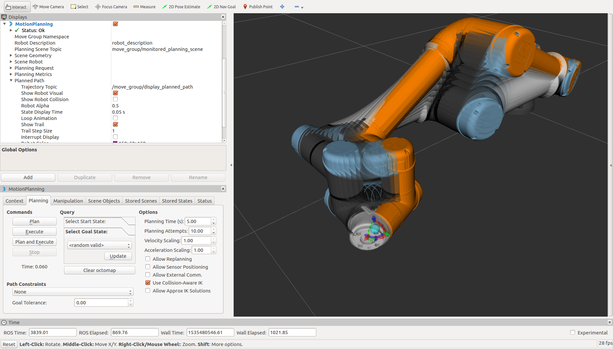
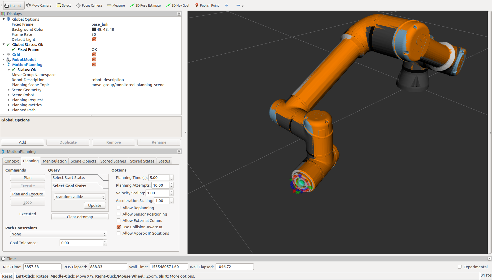
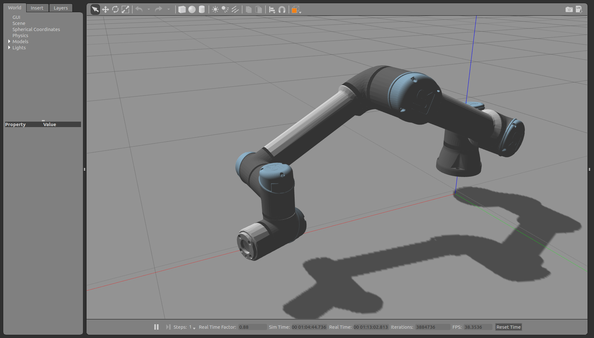

Controlling a UR5-E using MoveIt!
=================================

One of the most common ways to control a robotic manupulator is thorugh a package called MoveIt!.  MoveIt! is responsible for
creating collision-free motions plans for manipulators, then sending those motions to the arm controller.  You can use tools like RVIZ
to view the plan before it is executed to ensure it is what you want.

To use MoveIt! with a manipulator, a configuration must be created for the system.  For this tutorial, we will be using a pre-made
configuration.

Installing UR5-E MoveIt! Configs
--------------------------------

To install a pre-configured MoveIt! configuration for the UR5-E, run the command below:

.. code:: bash

    sudo apt-get install ros-kinetic-ur5-e-moveit-config ros-kinetic-moveit-plugins

Other example configurations are also available for the other types of Universal arms.  To install them, just change the number in
the package name, or remove the "-e" if you are using an older model of arm.

Run MoveIt!
-----------

MoveIt! is a seperate package that is run to add a new control layer on top of the manipulator hardware (simulated or physical).  It
will look at the structure of the arm's kinematic system, all of the geometry that makes up the hardware, the velocity, acceleration,
and physical limits of the axes, and create a path that will get the arm from where it is to where you command it to go.

To run this MoveIt! package, run the command below:

.. code-block:: bash

    roslaunch ur5_e_moveit_config ur5_e_moveit_planning_execution.launch sim:=true

Note that when we run the command above there is an option at the end for "sim".  This needs to be set to "true" if you are working with an arm that is
being simulated in Gazebo.  If you are working with a physical arm, this variable can be omitted.  Also, just because there is a
"ur5_e_moveit_planning_execution.launch" file does not mean this is the launch file name format that will work with every manipulator.  Each package
may have a different launch to connect MoveIt! to the manipulator.

You may see a couple of warnings come up in the terminal window, but you should see no red text.  It should end with the line "You can start planning now!"

Connecting to MoveIt! from RVIZ
-------------------------------

After you've started the MoveIt! configuration and installed the RVIZ plugins in the previous steps, you want to start (or restart) RVIZ to be able to work with MoveIt!.

.. code-block:: bash

    rosrun rviz rviz

You should see RVIZ appear using the same configuration we previously setup:

MoveIt! is a fairly complex tool with lots of options, additions, and settings to control manipulators.  Because of this, it has
its own plug-in for RVIZ.  It does have a command-line interface as well as libraries for integrating the control into other nodes, but we are
going to use RVIZ as it is simpler to see what is going on.

To enable the plugin, click "Add" in the bottom-left corner and select

The new Display may take a few seconds to set itself up, depending on your computer.  Like the previous step, you may see some yellow warnings in the terminal you
started RVIZ in, but you should not see any red errors.

Now that RVIZ is connected to MoveIt!, you can disable the RobotModel Display as the MoveIt! Motion Planning Display will show the current state of the arm.

Move the Arm!
-------------

Now that MoveIt! is connected through RVIZ, We can make it move!  First, select which Move Group you would like to control.  Depending on the manipulator you
are using, you may have different options.  For a simple Universal manipulator, you will likely use the group called "manipulator".

To select this, expand Motion Planning > Planning Request and select "manipulator" from the Planning Group drop-down

Once you select the correct planning group, you should see a small Interactive Marker appear at the end of the arm.  If you don't see this for some reason, change the
Interactive Marker Size under MotionPlanning > Planning Request.

The Universal manipulator in Gazebo will likely start with axis 5 at 0 degrees.  This is a singularity, which means inverse-kinematics planning is very difficult.  The
best option with singularities is to avoid them.  To do this, use your mouse to grab the blue ring of the Interactive Marker and rotate it so the wrist is closer to
the robot.  This will turn axis 5 and you won't be in singularity anymore.

When you turn it, you will see a second manipulator show up inside RVIZ.  This is the Goal manipulator, which represents where the robot will go.  When the Goal manipulator
is in a good position, under Planning in the MotionPlanning Display, click "Plan".  You will see a moving manipulator appear and move through the path from the current
position to the Goal position.  There are settings under MotionPlanning > Planning Request to control how this planned path is displayed.

If the planned path looks like a reasonable motion, back under the MotionPlanning Display, you will see an "Execute" button.  Clicking that will actually command the
manipulator to follow the motion that was planned.  This is also true if you are using a physical manupulator instead of a simulated one.  Once you execute the path, you
will see the arm move in RVIZ.

Changing your window back to Gazebo will show the arm moved to the Goal location.

