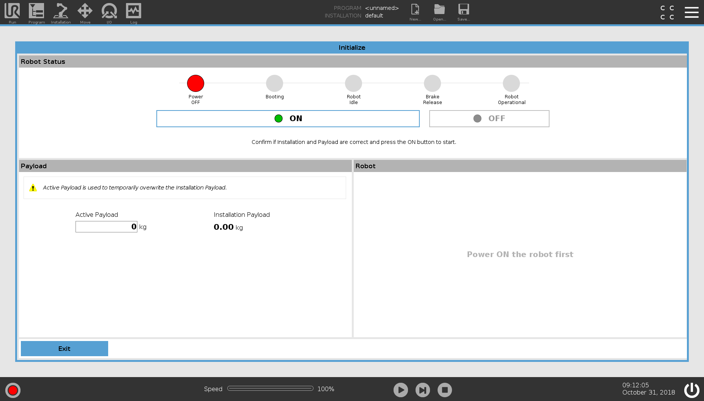
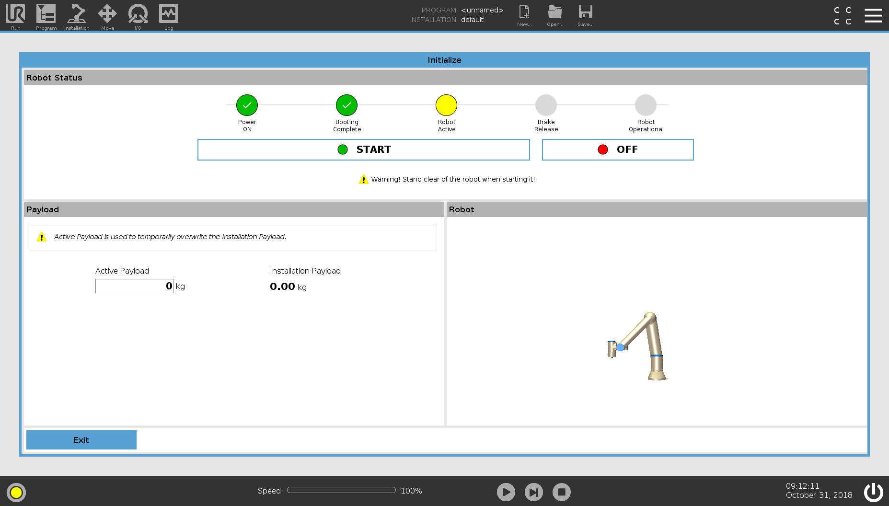
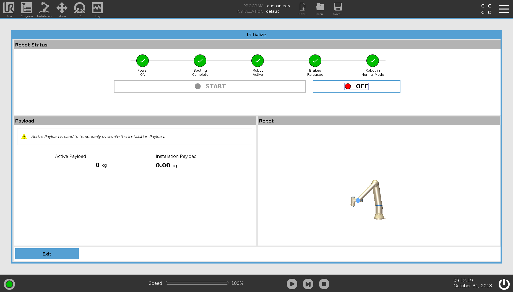
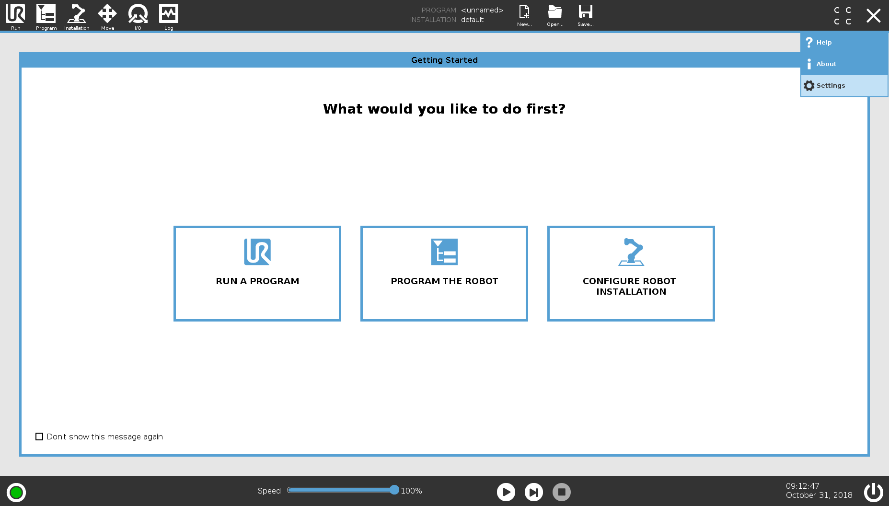
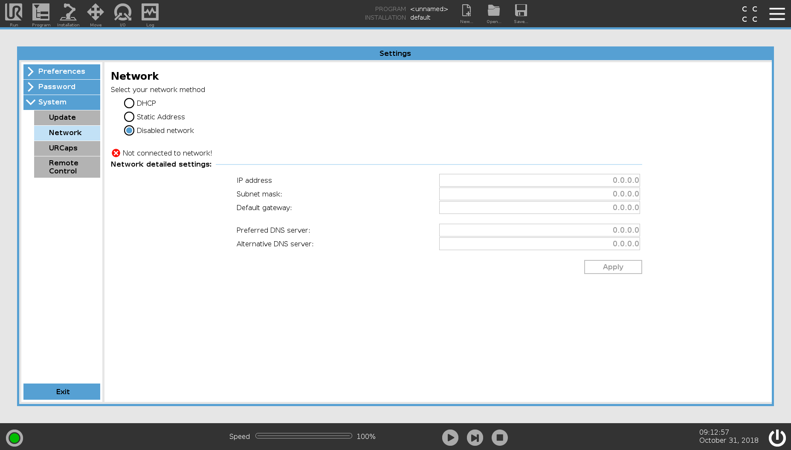
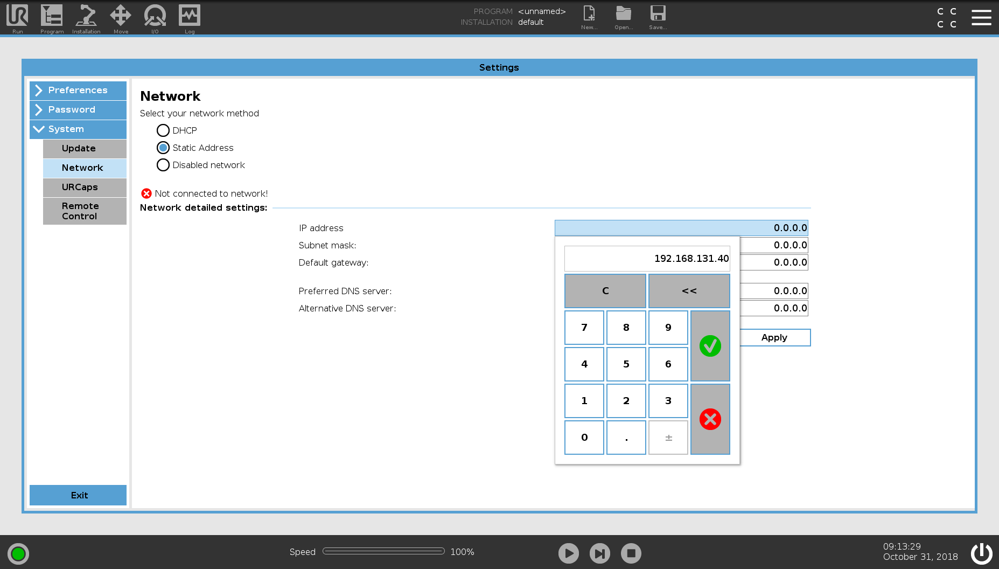
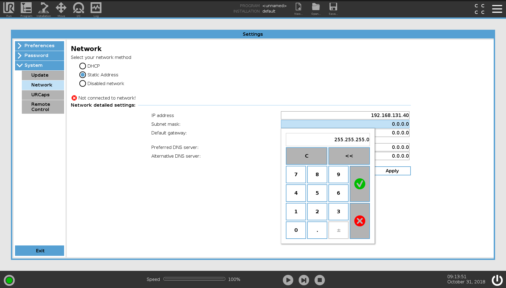
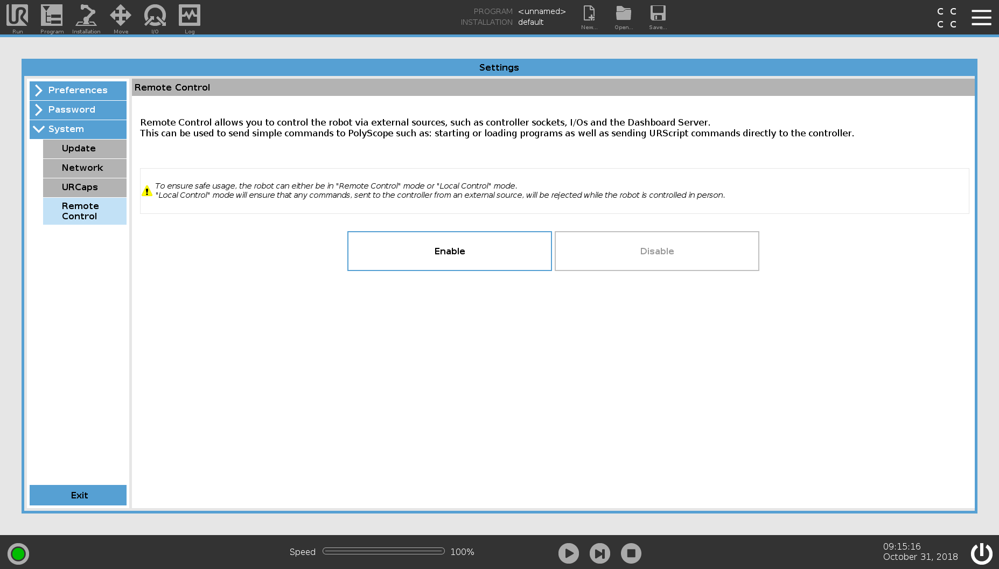
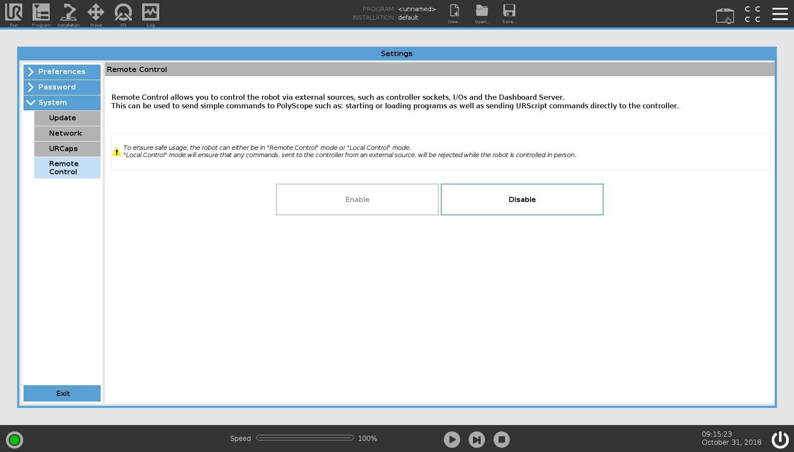
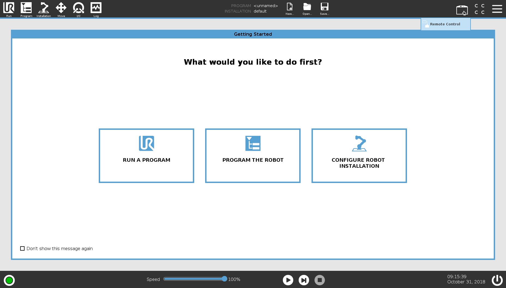

URE Controller Setup
====================

Initializing the UR Arm
-----------------------

When the controller first turns on, the arm will need to be powered and initialized.

.. image:: images/controller/1.png
    :alt: UR Main Screen

On boot, the arm will bring up the Initialization interface automatically.

Turn the arm on by pressing the ON button.  This powers the arm and initiates a connection with it.

Once the arm is connected and powered, PolyScope will release the brakes and move each joint slightly to calibrate its position.  This will move the arm slightly.  Make sure that nothing is touching the arm.

Close the Initialization screen by pressing Exit.

Setup the UR Arm Networking
---------------------------

The next step is to setup the arm's networking.  To change these settings, the menu in the top-right then press Settings.

On the left side, select Network.  In this menu, change the Network Method to be Static Address.  Depending on your network setup, you may be able to set it to DHCP and skip the rest of these steps, but these instructions are assuming you are only using a single ethernet cable and no other networking infrastructure.

Select the IP Address entry box and put in an IP address.  The first 3 sets of numbers should match the IP address you have on your computer.

Enter a subnet mask that also matches what you are using on your computer.

In version 5+ of Polyscope, extra safety/security has been added around remote control of the arm.  Because of this, explicit control must be granted to allow an external system to send motion commands to the arm.
To enable this feature, select Remote Control on the left side of the Settings menu

Press Enable.

This allows Remote Control to be toggled, but does not fully authorize this feature.  To do that, exit this menu using the Exit button.  In the top-right of the window, you will see a new icon that looks like the UR pendant.  To allow remote control, select this icon and choose Remote Control.
Once you change the controller to remote control, it will lock-out a number of features on the pendant, but allow external controllers such as ROS to interact with the arm.

Once this is all done, it should be setup!  Restart the controller and come back to the networking menu to verify that the settings were applied.  Make sure that the controller is connected to a network (or the ROS computer) before starting the controller.  The UR controller may not bring up its networking if it is not connected to another device.  When the controller starts up again, make sure to re Initialize the arm to enable control and movement and select Remote Control from the top-right button.
