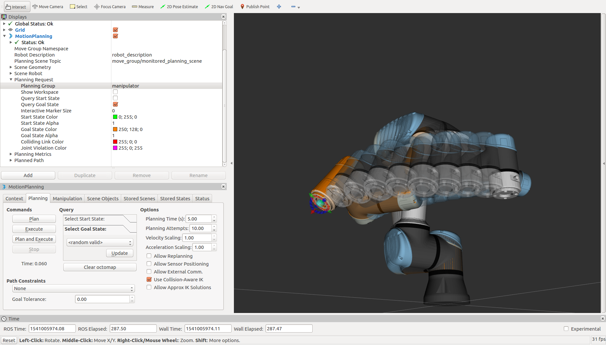

URE Setup Tutorial
==================

This package supplies Sphinx-based tutorial content to assist you with setting up and operating a URE manipulator
with ROS. The tutorials topics are listed in the left column, and presented in the suggested reading order.
:doc:`Controller <controller>` is a logical place for most users to start, as this is necessary for any remote
connection;
:doc:`ROS <ros>` is a continuation of the setup that will cover how to connect, monitor, and drive your newly setup
URE manipulator
