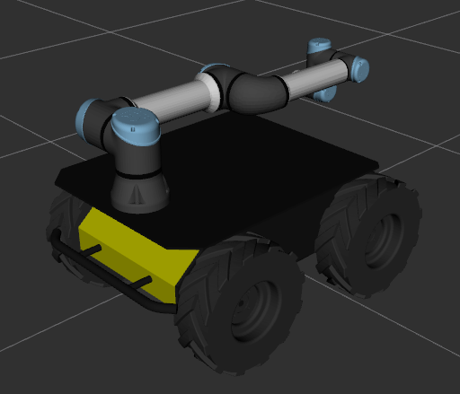

URE ROS Setup
=============

This page will instruct you in how to install and use the `Universal Robots ROS Driver <https://github.com/UniversalRobots/Universal_Robots_ROS_Driver>`_.
this open-source driver is maintained by Universal Robots and allows control of the arm using ROS controllers and tools such as `MoveIt <http://wiki.ros.org/moveit>`_.

This driver replaces the now-deprectated `ur_modern_driver <http://wiki.ros.org/ur_modern_driver>`_.

Before you can use the driver with a physical arm, make sure you have :doc:`configured the arm and installed the external control URCap <controller>`.

This guide assumes you have a UR5e arm mounted to a `Clearpath Robotics Husky UGV <https://clearpathrobotics.com/husky-unmanned-ground-vehicle-robot/>`_,
though the arm may be mounted to other platforms including the `Warthog UGV <https://clearpathrobotics.com/warthog-unmanned-ground-vehicle-robot/>`_
and `Ridgeback <https://clearpathrobotics.com/ridgeback-indoor-robot-platform/>`_.  Other arms, such as the UR3e are also supported.

Installing the ROS Driver
-------------------------

The driver must be built from source code in a Catkin workspace.  If you already have a workspace on your system you may use that, or you can create a new workspace
by running the following commands:

.. code-block:: bash

    source /opt/ros/melodic/setup.bash
    mkdir -p $HOME/catkin_ws/src
    cd $HOME/catkin_ws
    catkin_init_workspace src

Once the workspace is created, clone the driver and its dependencies:

.. code-block:: bash

    cd $HOME/catkin_ws/src
    git clone https://github.com/UniversalRobots/Universal_Robots_ROS_Driver.git src/Universal_Robots_ROS_Driver.git
    git clone -b calibration_devel https://github.com/fmauch/universal_robot.git src/fmauch_universal_robot.git

Clearpath Robotics provides a dedicated manipulation package intended to make using the UR5e and UR3e arms easier on several platforms, such as the Warthog, Husky and Ridgeback.
Clone the appropriate repository into your catkin_ws:

.. code-block:: bash

    # only install the packages needed for your platform
    git clone -b melodic-devel https://github.com/husky/husky_manipulation.git
    git clone -b melodic-devel https://github.com/warthog-cpr/warthog_manipulation.git
    git clone -b melodic-devel https://github.com/ridgeback/ridgeback_manipulation.git

.. note::

    When using the ``husky_manipulation``, ``warthog_manipulation``, or ``ridgeback_manipulation`` package, you may get warnings from ``rosdep`` that not all
    dependencies could be installed.  This is normal; the manipulation packages include dependencies for all supported arms, including ones made by Kuka, UR, and Kinova, as
    well as manipulators such as Robotiq 2- and 3-finger grippers.  If you are only using a UR E-series arm, the missing Kuka, Kinova, and Robotiq dependencies may be
    safely ignored.

Finally, compile the driver by running:

.. code-block:: bash

    cd $HOME/catkin_ws
    rosdep install --from-paths src --ignore-src -r -y
    catkin_make

Add the Arm to Your Robot's Description
---------------------------------------

Once the ROS driver has been installed, you can add the arm to your robot's URDF by using the robot's ``URDF_EXTRAS`` environment variable.  For example, to add a UR-5e to a Husky,
simply run the following:

.. code-block:: bash

    export HUSKY_URDF_EXTRAS=$(catkin_find husky_ur_description urdf/husky_ur5_e_description.urdf.xacro --first-only)

.. note::

    For other supported platforms, see their respective ``*_ur_description`` packages, e.g.
    `ridgback_ur_description <https://github.com/ridgeback/ridgeback_manipulation/tree/melodic-devel/ridgeback_ur_description>`_
    or `warthog_ur_description <https://github.com/warthog-cpr/warthog_manipulation/tree/melodic-devel/warthog_ur_description>`_.

Verify that your URDF shows the arm by running

.. code-block:: bash

    roslaunch husky_viz view_model.launch

You should see the model of the Husky with the UR5e arm mounted to it:

If your robot also has additional sensors and other payloads, you may instead simply include the ``husky_ur5_e_description.urdf.xacro`` file
inside another URDF file:

.. code-block:: xml

    <?xml version="1.0" ?>
    <robot xmlns:xacro="http://wiki.ros.org/xacro">
      <!-- Add the UR5e to the Husky -->
      <xacro:include filename="$(find husky_ur_description)/urdf/husky_ur5_e_description.urdf.xacro" />

      <!-- Add any additional sensors, link, etc... here. e.g -->
      <xacro:include filename="$(find realsense2_description)/urdf/_d435.urdf.xacro" />
      ...
    </robot>

Configure the ROS Systemd Job
-----------------------------

To permanently add the UR E-series arm to your Husky UGV, edit ``/etc/ros/setup.bash`` to add the following:

.. code-block:: bash

    # source your catkin workspace if you haven't done so already in this file
    source /home/administrator/catkin_ws/devel/setup.bash

    # set the HUSKY_URDF_EXTRAS environment variable to add the arm
    # if you included the UR5e description in a different file, change the path as needed
    export HUSKY_URDF_EXTRAS=$(catkin_find husky_ur_description urdf/husky_ur5_e_description.urdf.xacro --first-only)

    # set the IP address of the arm
    export HUSKY_UR_IP=192.168.131.40

After editing ``/etc/ros/setup.bash`` you will need to restart the ROS systemd job by running

.. code-block:: bash

    sudo systemctl restart ros

Launching the ROS Driver
------------------------

To start the ROS driver use the launch file included in the ``husky_manipulation`` package (or other robot's manipulation package, if you aren't using Husky).

.. code-block:: bash

    roslaunch husky_ur_bringup husky_ur_bringup.launch

Starting the ROS driver will open a TCP port that the External Control URCap will connect to.  Once the ROS driver has started, start the External Control
program on the UR Controller.

Starting MoveIt!
----------------

``MoveIt!`` is a motion-planning library that can be used to control the arm.  While the Universal Robots ROS driver provides direct control over the
position of each indivdual joint, MoveIt can be used to perform inverse-kinematics calculations, moving the arm's end-effector link to a desired
XYZ + RPY position in three-dimensional space.

To start the MoveIt planner, run

.. code-block:: bash

    roslaunch husky_ur_moveit_config husky_ur_moveit_planning_execution.launch

Once this is launched, you should see no errors in the terminal window.  There are cases where seeing warnings is not an issue.

.. image:: images/ros/4.png
    :alt: UR MoveIt! Successfully Launched

Setup RVIZ
----------

Now that you have the arm's driver and moveit configuration running in seperate terminals, it is time to view everything in a graphical interface.  To do this, open a new terminal and run:

.. code-block:: bash

    roslaunch husky_viz view_robot.launch

Once RVIZ loads, you may see a blank interface.

.. image:: images/ros/6.png
    :alt: Blank RVIZ

To be able to watch and control the arm, you will need to add the MoveIt! MotionPlanning plugin.  To load this, click Add in the bottom-left.

.. image:: images/ros/7.png
    :alt: Add MoveIt! MotionPlanning Plugin

In the list that is displayed, select MotionPlanning and click OK.

.. image:: images/ros/8.png
    :alt: MoveIt! MotionPlanning Plugin Setup

Now you should see the arm displayed in RVIZ.  If you don't see the arm, or the joints are in different positions that they are in reality, ensure that the driver is still running properly and that the arm has been Initialized.

Control the Arm!
----------------

To control the arm, you need to select the planning group you are going to use.  This is a simple setup so there is only one main group to select, but as you get into more complex manipulation systems, there may be multiple groups.
Under MotionPlanning > Planning Request, set the planning group to "manipulator".  This will create a second arm in the 3D window that is orange.

.. image:: images/ros/9.png
    :alt: Set Planning Group

This orange arm is the Goal state of the arm.  This means that when you plan a motion, the arm will plan from where it current is to where the orange arm is.
On the end of this new arm, there will be an Interactive Marker that you can use to adjust the Goal position.

.. image:: images/ros/10.png
    :alt: MoveIt! Interactive Marker

The arrows on this marker are translations relative to the end of the arm.  The arcs are rotation around those axes.  The blue ball in the middle will give cartesian linear control.
Click and drag any of these controls to move the arm into a new position. As you are dragging the end of the arm around, inverse-kinematics will be calculating joint angles for the rest of the arm.

.. image:: images/ros/11.png
    :alt: Set Goal State

Now that you have told the arm where you want it to go, press Plan under the Planning tab.  It may take a moment, but you should see the arm make a motion inside of RVIZ showing the path that it has planned to take.  There are settings under Planned Path that control how this plan is displayed in case you are having trouble visualizing how the arm will move.
Once you are satisfied with the planned path, click Execute to have the real arm follow the planned path.  Keep in mind that this will move the actual hardware in reality so ensure that the arm has a safe area to do so and that an e-stop button is within reach, just in case.

.. image:: images/ros/12.png
    :alt: Plan and Execute
