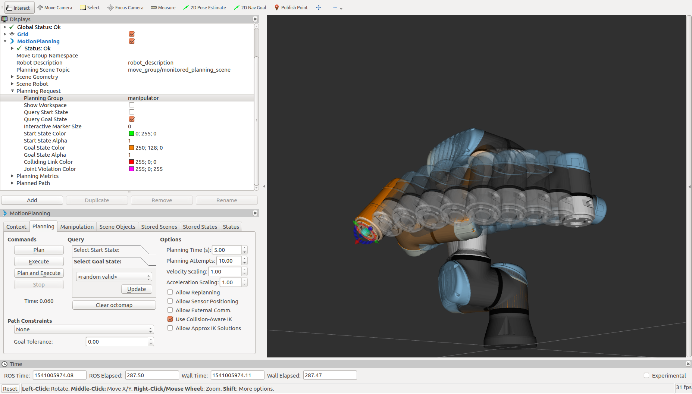

URE ROS Setup
=============

Launch the ROS Driver
---------------------

To connect to the arm so it can be controlled from ROS, we will be using the `ur_modern_driver <http://wiki.ros.org/ur_modern_driver>`_.  This driver is open-source and regularly updated by the community.  It can be installed using:

.. code-block:: bash

    sudo apt-get install ros-kinetic-ur-modern-driver

This driver has only been officially released for Indigo (at time of writing) so if the command above fails, you will need to download and build this from source.  You can download the `source code <https://github.com/ros-industrial/ur_modern_driver>`_ and `build the package <http://wiki.ros.org/ROS/Tutorials/BuildingPackages>`_ from source locally.
To launch the driver, run the command below.  You will replace <ur_ip_address> with the address you set in the networking setup of your arm.

.. code-block:: bash

    roslaunch ur_modern_driver ur5e_bringup_joint_limited.launch robot_ip:=<ur_ip_address>

Once the driver has started up, you should see the following lines to know it started and connected properly:

.. code-block:: bash

    Connection established for ur_ip_address:30002
    Connection established for ur_ip_address:30003
    Trajectory thread started

If you see any errors above, ensure:
- Your computer is connected to the arm with an ethernet cable
- Your computer has a IP address that is in the same range as the UR controller
- Your arm is setup properly by following :doc:`Controller Setup <controller>`

Start MoveIt!
-------------

Once your computer can contact the arm and has the driver running, you can now start MoveIt! so you can begin planning and commanding the arm through complex motions.  To start moveit, open a new terminal on your computer and run the command below:

.. code-block:: bash

    roslaunch ur5_e_moveit_config ur5_e_moveit_planning_execution.launch

Once this is launched, you should see no errors in the terminal window.  There are cases where seeing warnings is not an issue.

.. image:: images/ros/4.png
    :alt: UR MoveIt! Successfully Launched

Setup RVIZ
----------

Now that you have the arm's driver and moveit configuration running in seperate terminals, it is time to view everything in a graphical interface.  To do this, open a new terminal and run:

.. code-block:: bash

    roslaunch rviz rviz

Once RVIZ loads, you may see a blank interface.

.. image:: images/ros/6.png
    :alt: Blank RVIZ

To be able to watch and control the arm, you will need to add the MoveIt! MotionPlanning plugin.  To load this, click Add in the bottom-left.

.. image:: images/ros/7.png
    :alt: Add MoveIt! MotionPlanning Plugin

In the list that is displayed, select MotionPlanning and click OK.

.. image:: images/ros/8.png
    :alt: MoveIt! MotionPlanning Plugin Setup

Now you should see the arm displayed in RVIZ.  If you don't see the arm, or the joints are in different positions that they are in reality, ensure that the driver is still running properly and that the arm has been Initialized.

Control the Arm!
----------------

To control the arm, you need to select the planning group you are going to use.  This is a simple setup so there is only one main group to select, but as you get into more complex manipulation systems, there may be multiple groups.
Under MotionPlanning > Planning Request, set the planning group to "manipulator".  This will create a second arm in the 3D window that is orange.

This orange arm is the Goal state of the arm.  This means that when you plan a motion, the arm will plan from where it current is to where the orange arm is.
On the end of this new arm, there will be an Interactive Marker that you can use to adjust the Goal position.

.. image:: images/ros/10.png
    :alt: MoveIt! Interactive Marker

The arrows on this marker are translations relative to the end of the arm.  The arcs are rotation around those axes.  The blue ball in the middle will give cartesian linear control.
Click and drag any of these controls to move the arm into a new position. As you are dragging the end of the arm around, inverse-kinematics will be calculating joint angles for the rest of the arm.

Now that you have told the arm where you want it to go, press Plan under the Planning tab.  It may take a moment, but you should see the arm make a motion inside of RVIZ showing the path that it has planned to take.  There are settings under Planned Path that control how this plan is displayed in case you are having trouble visualizing how the arm will move.
Once you are satisfied with the planned path, click Execute to have the real arm follow the planned path.  Keep in mind that this will move the actual hardware in reality so ensure that the arm has a safe area to do so and that an e-stop button is within reach, just in case.

