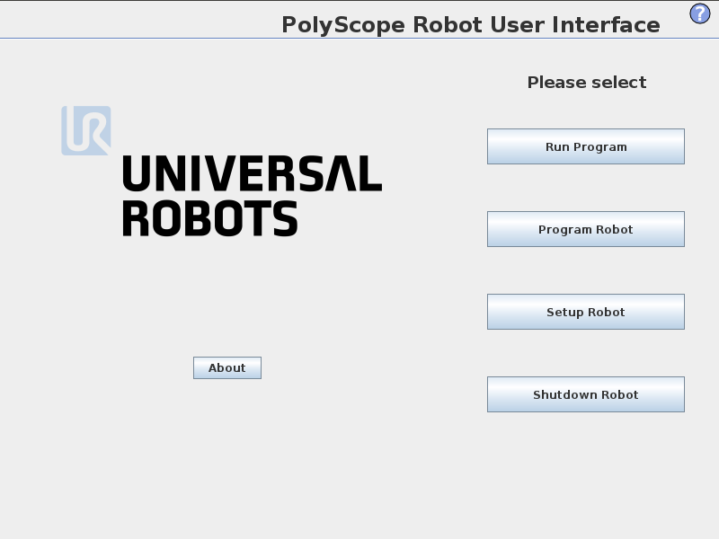
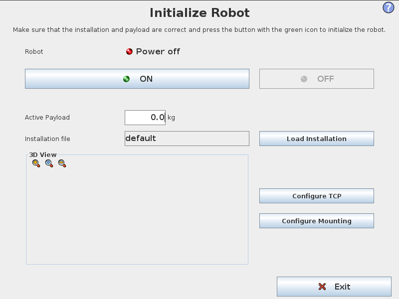
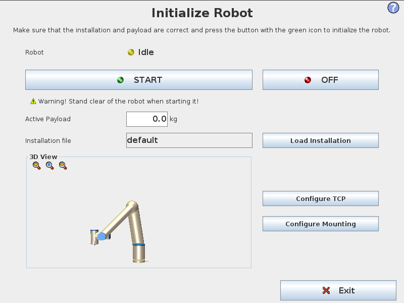
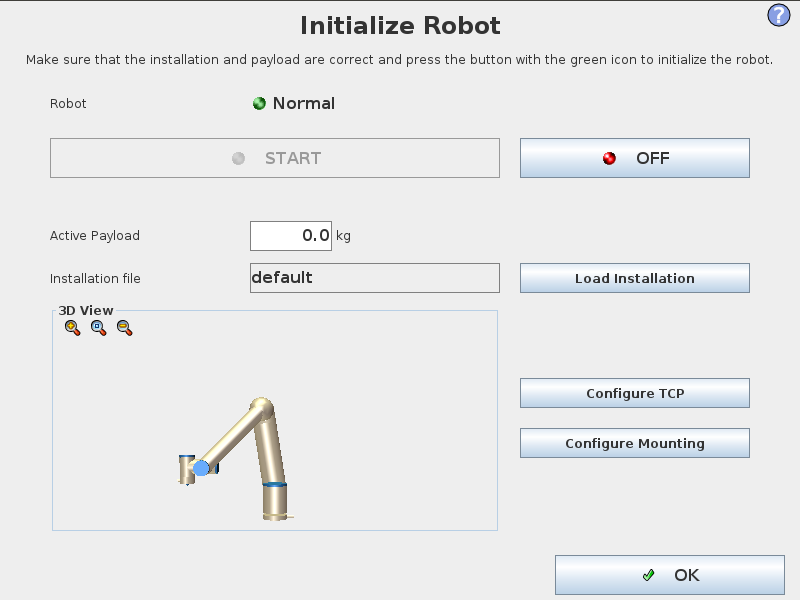
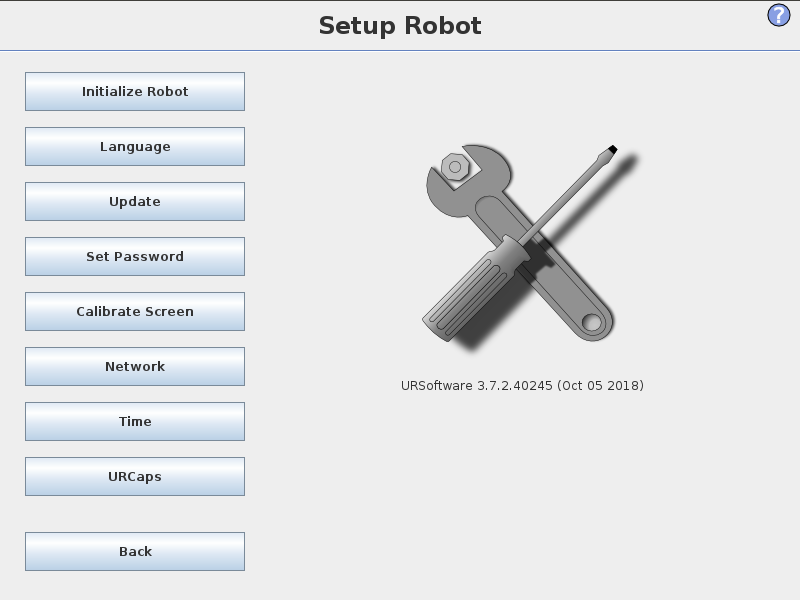
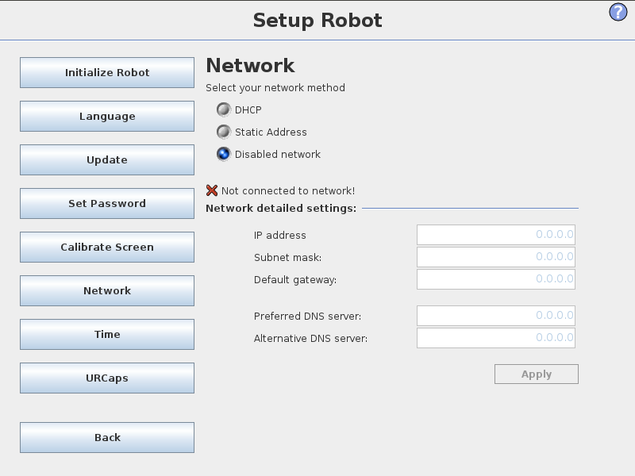
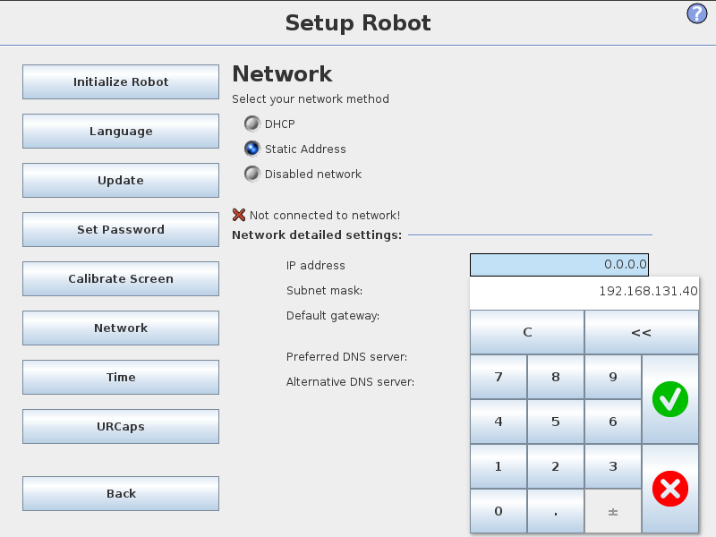
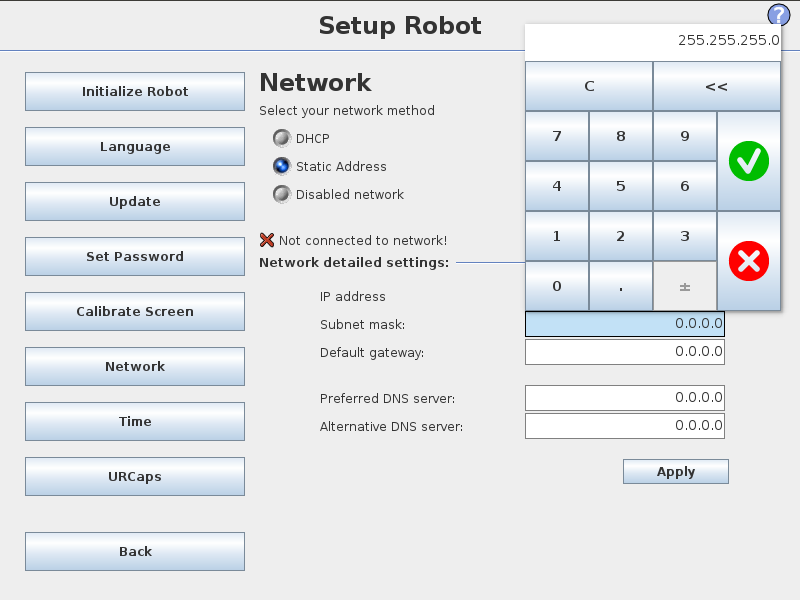

UR Controller Setup
===================

Initializing the UR Arm
-----------------------

When the controller first turns on, the arm will need to be powered and initialized.

To initialize the arm, press the red indicator in the bottom-left.

Turn the arm on by pressing the ON button.  This powers the arm and initiates a connection with it.

Once the arm is connected and powered, PolyScope will release the brakes and move each joint slightly to calibrate its position.  This will move the arm slightly.  Make sure that nothing is touching the arm.

Close the Initialization screen by pressing Exit.

Setup the UR Arm Networking
---------------------------

The next step is to setup the arm's networking.  To change these settings, first, close the Initialion menu by pressing OK.  Then, press Setup Robot.

On the left side, select Network.  In this menu, change the Network Method to be Static Address.  Depending on your network setup, you may be able to set it to DHCP and skip the rest of these steps, but these instructions are assuming you are only using a single ethernet cable and no other networking infrastructure.

Select the IP Address entry box and put in an IP address.  The first 3 sets of numbers should match the IP address you have on your computer.

Enter a subnet mask that also matches what you are using on your computer.

Once this is all done, it should be setup!  Restart the controller and come back to this menu to verify that the settings were applied.  Make sure that the controller is connected to a network (or the ROS computer) before starting the controller.  The UR controller may not bring up its networking if it is not connected to another device.  When the controller starts up again, make sure to re Initialize the arm to enable control and movement.

Install custom URCap
---------------------

To control the arm from an external computer with ROS you must install the External Control URCap program.

Instructions for installing the External Control program can be found on the `Universal Robots ROS Driver <https://github.com/UniversalRobots/Universal_Robots_ROS_Driver/blob/master/ur_robot_driver/doc/install_urcap_cb3.md>`_ documentation.

Once the External Control program has been installed and configured to allow control from your ROS PC, you will be able to :doc:`configure the ROS driver <ros>` and control the arm.
